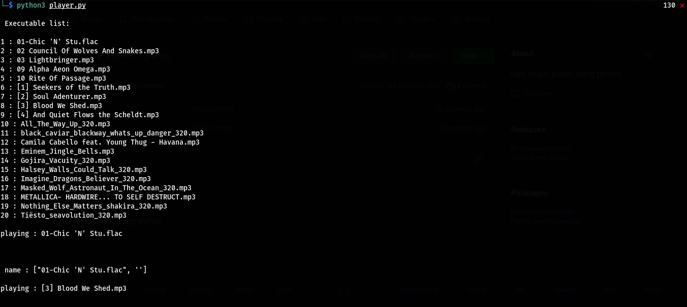

# Py-music-player
light music player using python 

This player is using the random lib for playing the music 

1: first change the directory to your musics directory 

2: paste the program there

3: run the code below 

<code>python3 PyPlayer.py</code>

Pic from the application envoirment 

